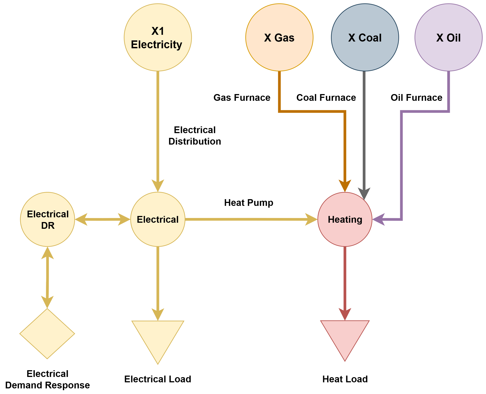

(data-industrial)=
# Industrial Sector

PyPSA-USA's industrial module captures the flow of energy associated with all heavy industry. The module aggregates all industry together and does not differentitate between different industry classes. For example, low and high temperature heat requirements are aggregated together into a single heat demand.

```{note}
The industrial sector's implementation is currently quite simple. Much room exists to improve industry sector demand and teachnology representation!
```

## Demand

The demand methodology follows a similar methodology to that propsed by NREL in their[ Demand Side Grid](https://www.nrel.gov/docs/fy18osti/71492.pdf) model. Notably, final demand is created from three components; The load profiles, the annual load magnitudes, and the load dissagrgation.

### Demand Profiles

Demand profiles are taken from the [EPRI Load Shape Library](https://loadshape.epri.com/enduse). Average profiles for on and off peak seasons at a NERC region level are extracted. EPRI does not give explicit electrical/heating/cooling/petrol demands, rather, they give demand by end-use. We manually group these into heating and elctrical load. A sample of these profiles is given in the figure below.

:::{figure-md} load-profile


Industrial Profiles by Fuel
:::

### Demand Magnitude

Annual demand magnitudes are taken from NREL [County Level Industry Use](https://data.nrel.gov/submissions/97) (CLIU) dataset and scaled according to the [EIA Manufacturing Energy Consumption Survey](https://www.eia.gov/consumption/manufacturing/) (MECS). This follows the same process described by the the [NREL Industry Energy Tool](https://github.com/NREL/Industry-Energy-Tool). Projections of industrial fuel demand come from the [EIA Annual Energy Outlook](https://www.eia.gov/outlooks/aeo/) (AEO).

The CLIU dataset gives estimates of total end-use industrial fuel demand by county in 2014. As this dataset is now quite old, and derived from emissions rather than end-use processes, it is scaled agaist the MECS. The MECS gives regional (9 regions for the USA) reported end-use energy consumption by NAICS code. Therfore, the CLIU fuel demand is scaled to match regional energy demand from MECS.  Daily load results of overlaying the EPRI demand profiles on the CLIU/MECS data is shown in the figure below.

:::{figure-md} loads


Industrial Profiles by Fuel Type for a typical week
:::

Future energy projections for the industrial are extracted from the AEO industrial energy projections. An example of energy projections in the industrial sector is given in the Figure below.

:::{figure-md} aeo-industrial


Annual Energy Outlook industrial end-use consumption projections, with select scenarios.
:::

```{note}
The AEO does give industry specific (ie. food, paper, mining, ect.) energy consumption projections [here](https://www.eia.gov/outlooks/aeo/data/browser/#/?id=6-AEO2023&cases=ref2023&sourcekey=0). However, since industry load does not currently differentiate between NAICS code, total energy is used to scale demand.
```

### Demand Dissagregation

Industrial demand dissagregation follows NREL's [County Level Industry Use](https://data.nrel.gov/submissions/97) (CLIU) dataset. This dataset gives industiral end-use demand by fuel type at a county level. Notably, this dissagregation strategy is different thatn the strategies used for the service and transport sector, which are based on population distributions. Industrial demand often does not follow population distributions, and dissagregating against CLUI captures this. As example of this dissagregation is shown in the Figure below.

:::{figure-md} demand-dissagregation


Industrial demand dissagregation examples for (a) California. (b) Texas. (c) Michigan. (d) New York.
:::

## Implementation

The available technologies in the industrial sector is limited, due to industrial demand being aggregated. The schematic and table below give an overview of the industrial sector implementation in PyPSA-USA. Of note is that no on-site electricity generation is avaialble; moreover, combined heat-to-power systems are not yet implemented.

```{eval-rst}
.. csv-table::
   :header-rows: 1
   :widths: 22,15,30
   :file: datatables/industrial_sector_techs.csv
```

:::{figure-md} implementation


Industrial Sector representation in PyPSA-USA.
:::

## Data Sources

Listed below are the main datasources applied within the industrial sector.

```{eval-rst}
.. csv-table::
   :header-rows: 1
   :widths: 22,22,22
   :file: datatables/industrial_sector_data.csv
```

## Validation

```{note}
Sector coupling studies are all under active development. More info to come!
```
