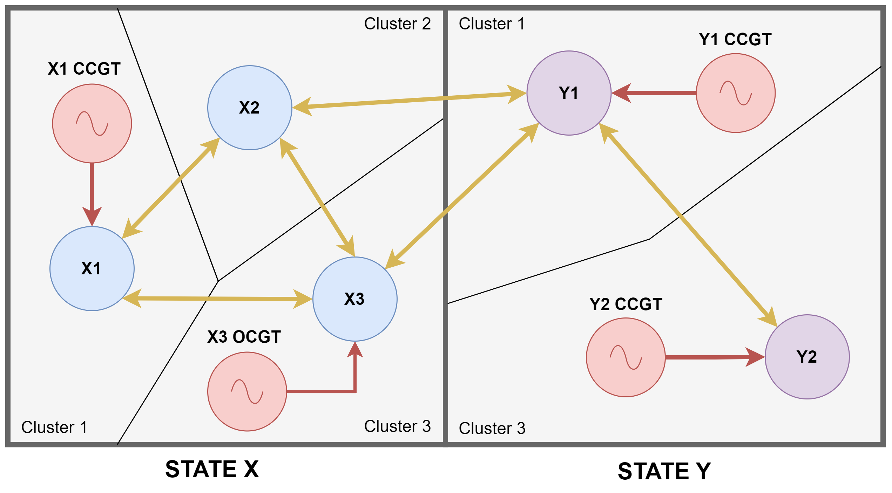
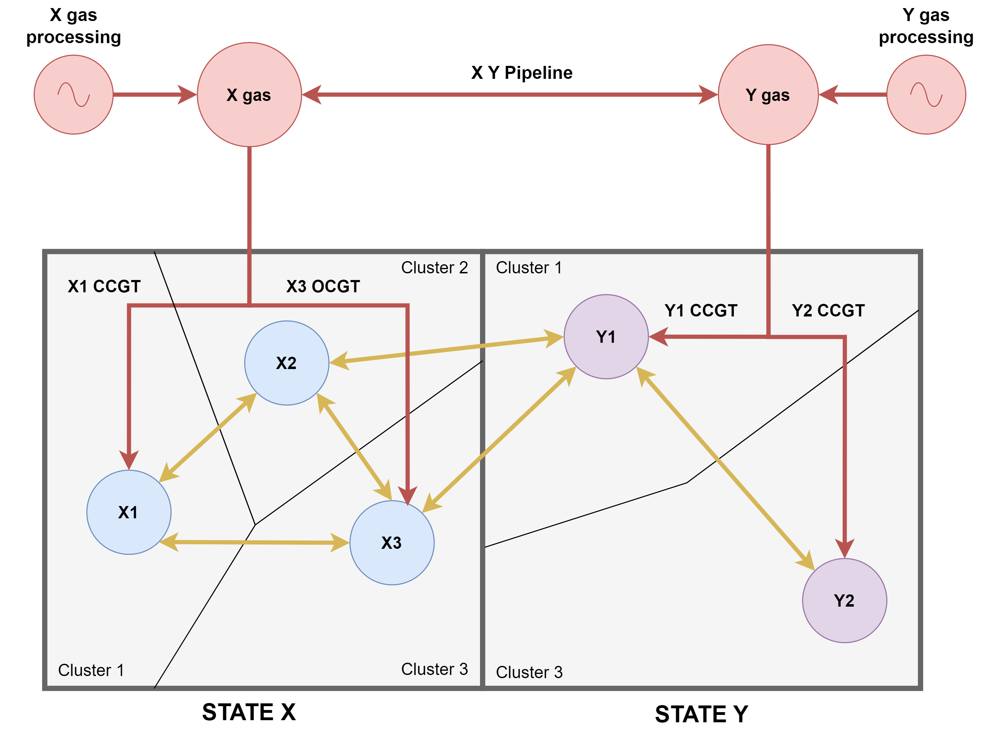
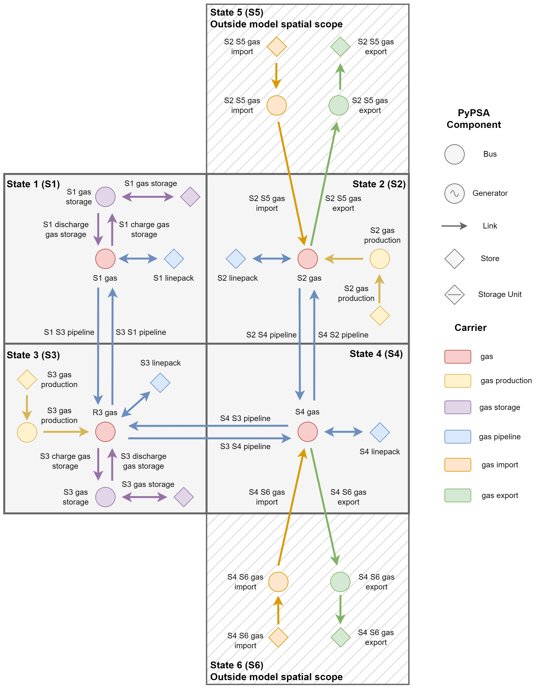
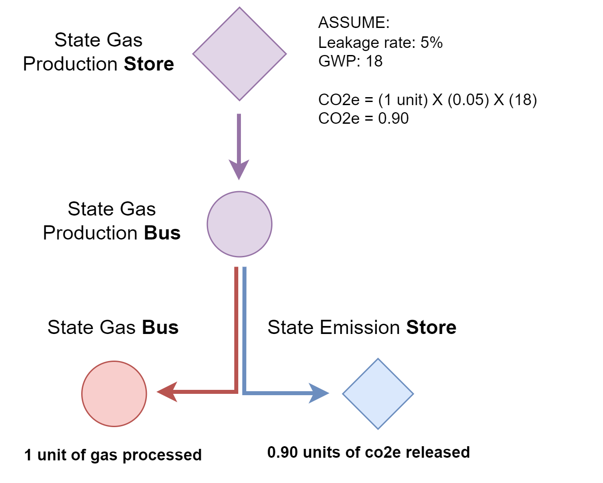

(data-naturalgas)=
# Natural Gas Sector
## Overview

PyPSA-USA models the natural gas network at a state level - as the [EIA](https://www.eia.gov/naturalgas/) reports gas data at a state levels. The addition of the gas network happens after the builing of the electrical network (including clustering).

Included in the natural gas netowrk is state level pipelines, state-to-state pipeline capacity, state level import/export capacity by point-of-entry, facility level underground storage limits, and state level gas-processing capacity. Additionally, users can choose to enforce domestic and international import/export limits to states/provinces outside of the model scope, matching historical trade volumes. Methane tracking is represented as a function of total injected natural gas into the system, with configurable leakage rates and global warming potentials.

```{note}
Only dry natural gas is tracked, not LNG.
```

## Model Implementation

This section will give details on how natural gas is modelled within PyPSA-USA.

### Spatial Representation

The natural gas network is represented at a state level, as [EIA Natural Gas](https://www.eia.gov/naturalgas/) data is often reported at state levels. The gas network is overlaid on the electrical sector, not changing the clustering done upstream in the workflow. Central state-level gas buses are created to facilitate the transportation and consumption of gas. Natural gas generators (for example combined-cycle and open-cycle gas turbines) retain all technical and economic paramters, but are changed to connect to the state level bus.

Consider the two state model shown below. State X has 3 clustered regions and 2 natural gas generators, while state Y has 2 clustered regions and 2 natural gas generators. Each clustered node may have other generators, loads, and connections, not shown here for simplicity. [Figure 1](spatial-before) shows how the electrical sector will create the network. [Figure 2](spatial-after) shows how the natural gas modifies the network. The other components (such as pipelines and gas processing) are described in the [next section](#sector-representation).


:::{figure-md} spatial-before


Electrical Network Spatial Representation
:::

:::{figure-md} spatial-after


Electrical and Gas Networks Spatial Representation
:::

### Sector Representation

The natural gas network includes the following components. All components attach a the central state level natural gas bus. The following [figure](gas-components) shows how the different components connect.

```{eval-rst}
.. csv-table::
   :header-rows: 1
   :widths: 22,22,33
   :file: datatables/natural_gas.csv
```

:::{figure-md} gas-components


Natural Gas Network Components
:::

### Import/Exports

Regions outside the model scope include connections to neighbouring states (for USA), provinces (for Canada), or countries (for Mexico). For example, if a model of Washington, Oregon, and California is run, the following import/export connections will be made. If no pipeline exisits between the regions, or is one-directional, the capacity is set to zero.

| Modelled Region | Connecting Region | Type          |
|-----------------|-------------------|---------------|
| Washington      | British Columbia  | International |
| Washington      | Idaho             | Domestic      |
| Oregon          | Nevada            | Domestic      |
| California      | Nevada            | Domestic      |
| California      | Arizona           | Domestic      |
| California      | Mexico            | International |

Additionally, the user can choose to enforce boundary conditions on these connections. If applied, annual historical imports and exports to the neighbouring regions are retrieved from the EIA for the modelled weather year. Constraints are added to match the import/export values over the year.

### Capacity Expansion

PyPSA-USA does not currently support natural gas pipeline expansion and retrofitting.

### Methane Tracking

Leaks in the natural gas system are often categorized into upstream and downstream leaks. Upstream leaks inclde leaks from production and processing. Downstream leaks include leaks from transportation, falaring, and incomplete fuel combustion. PyPSA-USA groups upstream and downstream leaks together and applies a leakage rate as a percentage of natural gas injected into the system. Moreover, a global warming potential is applied to the leaked gas the represent the intensity of methane compared to carbon dioxide over different time-frames. The follow [figure](methane-tracking) graphically shows how methane is accounted in PyPSA-USA.

:::{figure-md} methane-tracking


Methane Tracking in PyPSA-USA
:::

## Data Sources

Listed below are the main datasources and assumptions applied to them to build the natural gas network.

```{eval-rst}
.. csv-table::
   :header-rows: 1
   :widths: 22,22,33
   :file: datatables/natural_gas.csv
```

## Validation

```{note}
Sector coupling studies are all under active development. More info to come!
```
