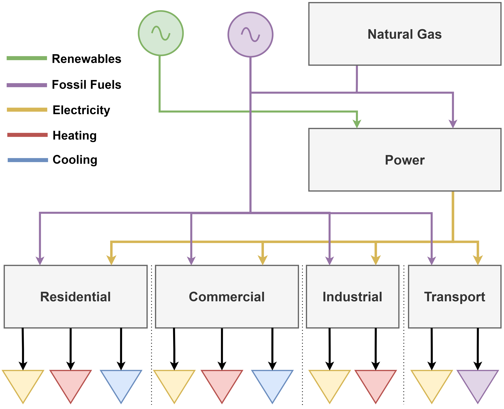
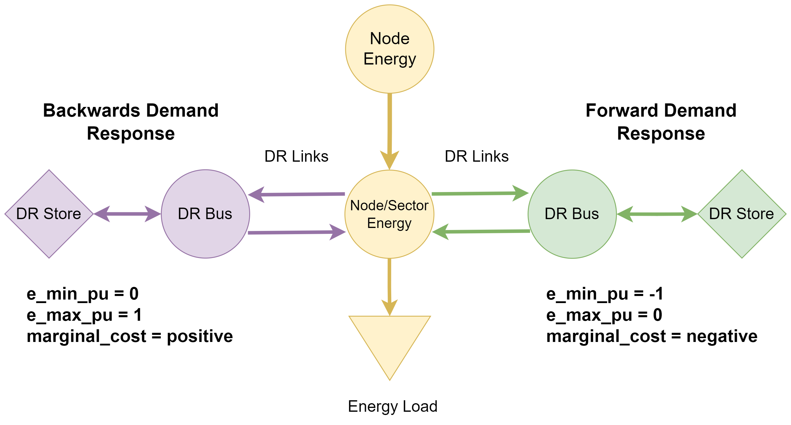
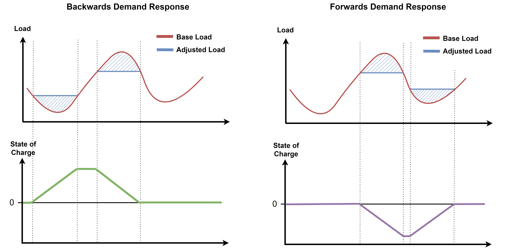

(data-sector-coupling)=
# Sector Coupling

Full energy system models can be run through PyPSA-USA. This page gives an overview of the functionality to run sector-coupled energy models.

## Overview

Sector coupled models are built ontop of the power sector representation. This means all assumptions[^1], including spatial and temporal options, implemented to bild the electricity sector are shared in sector coupled studies.

When running sector coupled studies, four end use sectors are added to the system. These include residential, commercial, industrial, and transportation. Each of these sectors will always have electrical loads. Then, based on user configuration options, heating, cooling, or fossil fuel loads may be added to the system. Moreover, the natural gas network is added to track imports/exports, storage levels, methane leaks, and endogenously solve for natural gas cost.

```{important}
Functionality to turn off heating, cooling, and lpg loads are still under development. Currently, models always run with all loads.
```

A high level overview of how all sectors interact is shown in Figure below.

:::{figure-md} sector-res


Simple representation of the sectoral interactions in PyPSA-USA
:::

[^1]: With the exception of CO2 emission targets.

## Emission Targets

Sector coupled studies implement emission limits different from power sector studies. The difference comes from allowing different sectors to decarbonize at different rates. Often hard-to-decarbonize sectors, like particular industrial applications, will have slower decarbonization targets compared to sectors with commercialized solutions (like electric vehicles). See the [configuration page](./config-sectors.md#carbon-limits) for details on how to implement these emission targets.

## Demand Response

Demand response is implemented the same for all end-use sectors, so it is covered here. Demand response is energy carrier agnostic, and can be applied to any end use demand. For example, both electrical loads and space-heating can participate in demand response.

### PyPSA Implementation

A price based demand respose program is impelemnted in PyPSA-USA. Demand can be shifted, either forward or backwards, and stored for any period of time. For each hour energy is stored, a cost is incurred to the system at a per-unit level (ie. $/MhW). PyPSA has out-of-the-box functionality to implement price based demand response programs. See the [`marginal_cost_storage`](https://pypsa.readthedocs.io/en/latest/user-guide/components.html#) parameter exposed for `Store` and `StorageUnit` components. To use this functionality to provide both forwards and backwards demand response, the following schematic is implemented.

:::{figure-md} demand-response


Demand response implementation in PyPSA-USA sectors
:::

Forward and backwards demand shifting is implemented seperatly for correct cost accounting. The need for this is shown in the following image. In backwards demand response, demand can be shifted to earlier points in time, allowing the model to store energy. However, for forward demand response, energy must be made available before it is generated by the system. This is done with a `Store` acting as a source (ie. negative storage levels) and a negative cost to store energy - this results in an increase in the objective cost to store energy.

:::{figure-md} dr-state-of-charge


Schematic showing forwards and backwards demand response
:::

```{important}
Demand response in the transportation sector is applied at an aggregated vehicle level. This means all road vehicle types participate follow the same demand response charasteristics (ie. demand response can not be split out so only light-duty vehicles participate). This is due to endogenous investments including both electric and gasoline vehicles.
```

### Capacity Constraints

Capacity constraints limit how much energy can be delievered through demand response at any point in time. To implement this, a custom constraint is implemented as shown below.

\begin{align*}
    &\ \text{let:} \\
    &\ \hspace{1cm} t\in T \hspace{1cm} \text{Set of snapshots} \\
    &\ \hspace{1cm} n\in N \hspace{1cm} \text{Set of buses} \\
    &\ \hspace{1cm} d_{n,t} = \text{Load at time } t \text{ and bus } n \\
    &\ \hspace{1cm} s_{n,t} = \text{Allowable shiftable load per unit of } d_{n,t} \\
    &\ \hspace{1cm} dr_{n,t} = \text{Discharge of demand response at time } t \text{ and bus } n \\
    &\ s.t. \\
    &\ \hspace{1cm} d_{n,t} \times s_{n,t} \leq dr_{n,t} \hspace{0.5cm} \forall_{\text{n,t}}\\
\end{align*}

This is not applied directly to the `Link` object via the `p_nom` paprameter to be consistent with the transport sector. Within the transport sector, demand response is applied to the aggregation bus due to endogenous investment options. Therefore, knowing how much electrical load to be shifted at each timestep is not trivial. For the transport sector, the following constraint is added. See the [transportation section](./data-transportation.md) schematics for details on where demand reponse is applied.

\begin{align*}
    &\ \text{let:} \\
    &\ \hspace{1cm} t\in T \hspace{1cm} \text{Set of snapshots} \\
    &\ \hspace{1cm} n\in N \hspace{1cm} \text{Set of buses} \\
    &\ \hspace{1cm} v\in V \hspace{1cm} \text{Set of electric vehicle links} \\
    &\ \hspace{1cm} p_{n,t,v} = \text{Flow at time } t \text{ and bus } n \text{ and link } v \\
    &\ \hspace{1cm} s_{n,t} = \text{Allowable shiftable load per unit of } d_{n,t} \\
    &\ \hspace{1cm} dr_{n,t} = \text{Discharge of demand response at time } t \text{ and bus } n \\
    &\ s.t. \\
    &\ \hspace{1cm}  \sum_{v}(p_{n,t,v}) \times s_{n,t} - dr_{n,t} \geq 0 \hspace{0.5cm} \forall_{\text{n,t}}\\
\end{align*}

## Further Information

Each sector has a dedicated page giving information on data sources, implementation details, and assumptions. See the corresponding page linked below.
- [Natural Gas](./data-naturalgas.md)
- [Servince Sector](./data-services.md)
- [Industrial Sector](./data-industrial.md)
- [Transportation Sector](./data-transportation.md)
