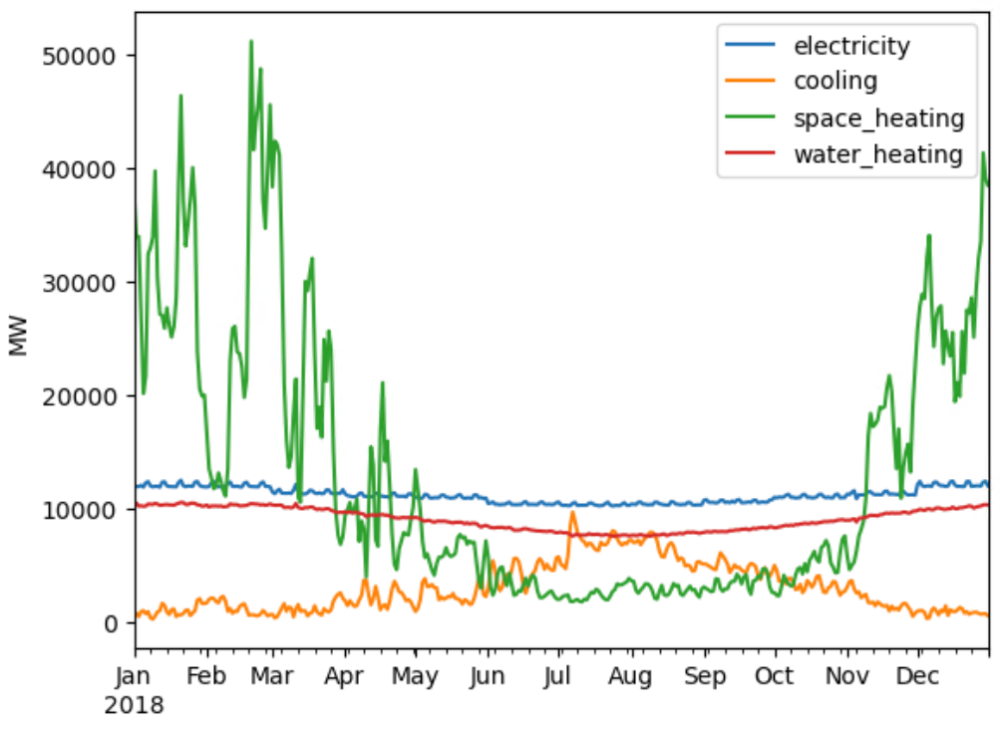

(data-services)=
# Service Sector

The service sector represents both the residential and commercial sectors. Each of these sectors are represented in the same way, but have different load shapes, profiles, and technology charasteristics.

## Demand

The service sector represents demand for electricity, cooling, space heating, and water heating. These loads are pulled at a state level from the [NREL End Use Load Profile](https://www.nrel.gov/buildings/end-use-load-profiles.html) (EULP) dataset. Loads are grouped based on end-use fuel aggregated to hourly values. Dissagregation follows same population based dissagregation method from the electrical network.

An example of the loads for a multi-family home in California (resampled to daily values) is given below.



The EULP dataset gives loads at a state level. The load is dissagregated following [population breakdowns](./data-demand.md#demand-disaggregation) described in the electrical network. Furthermore, if splitting urban and rural areas, load is split according to [Census metrics](https://www.census.gov/geographies/mapping-files/time-series/geo/cartographic-boundary.2020.html#list-tab-1883739534) on proportions living in urban/rural areas within each clustered region.

## Technologies

The following technologies are available to be modelled within the service sector

```{eval-rst}
.. csv-table::
   :header-rows: 1
   :widths: 22,22,30
   :file: datatables/sector_service_techs.csv
```

## Performance Characteristics

The following table gives an overview of the sources used to define the performance charactersitics of technologies in the service sector.

```{eval-rst}
.. csv-table::
   :header-rows: 1
   :widths: 22,22,22,22
   :file: datatables/sector_service_chars.csv
```

## Usage
