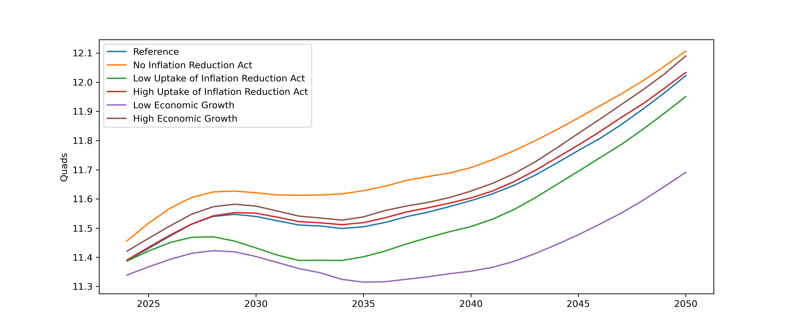
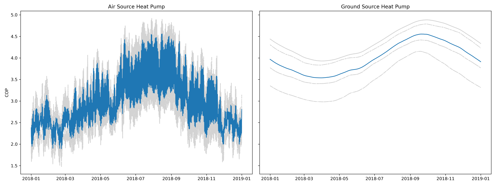
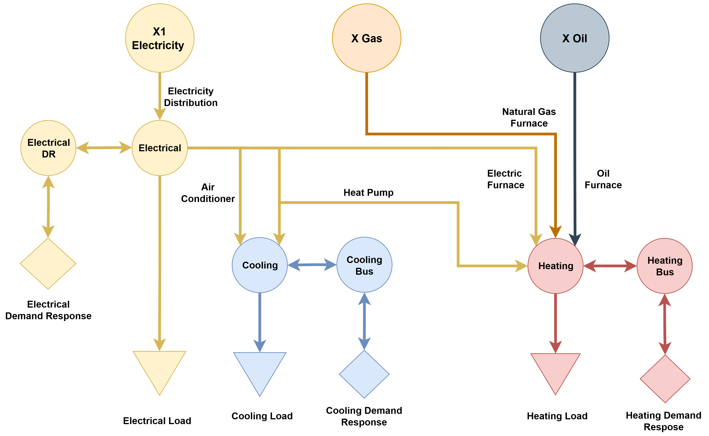

(data-services)=
# Service Sector

## Overview

The service seector represents both the residential and commercial sectors. Each of these sectors are represented in the same way, but have different load shapes, profiles, and technology charasteristics. The sectors can be split into urban and rural areas, to represent different technology adoption constraints, or grouped together. Additionally, the user can choose to aggregate the residential and commercial together, into a single service sector, to adjust to different reserach questions.

```{important}
Functionality to aggregate the residential and commerical together is still under development.
```

## Model Implementation

This section will give details on how the service sector is modelled within PyPSA-USA.

### Demand

The demand module for the service sector in PyPSA-USA can broadly be described in three steps. End-Use demand profile retrieval, demand dissagregation, and demand projections. This section will describe these three steps.

#### End-Use Profiles

The service sector represents demand for electricity, cooling, space heating, and water heating for the residential and commercial sector seperatly. These loads retrieved at a state level from the [NREL End Use Load Profile](https://www.nrel.gov/buildings/end-use-load-profiles.html) (EULP) dataset. Loads are grouped based by end-use fuel aggregated to hourly values. Users must always include electrical load. Heating and cooling loads are optional. Heating loads can be modelled to include `space-heating` and `water-heating` seperatly, or aggregated together into a single `heat` load. The following figures show processed state level data for the residential and commercial sector in California.

:::{figure-md} eulp-residential


Residential sector demand in California. (a) Yearly load profile resampled to daily average. (b) Actual hourly profile for the first week of the year read by PyPSA-USA.
:::

:::{figure-md} eulp-commercial


Commercial sector demand in California. (a) Yearly load profile resampled to daily average. (b) Actual hourly profile for the first week of the year read by PyPSA-USA.
:::

:::{note}
End-use load profiles are exogenously defined, but grid level load profiles are endogenous. For example, if the model may choose to replace furnaces with heat-pumps to supply heat demand. In this case, the total electrical load on the grid increases, but the end-use electrical load profile remains the same.
:::

#### Dissagregation

Demand dissagreation is a two step process, with each end-use fuel being dissagregated following the same method.

First, the EULP provides load data at a state level which must be allocated to clustered regions. State level load is dissagregated following the same population-based described in the [electrical network](./data-demand.md#demand-disaggregation). The following figure shows a sample of how each of the four end-use residential demands are allocated for a 4 zone network in California.

:::{figure-md} demand-clusters


Sample clustered residential sector demand in California
:::

Next, users can choose to split each cluster into urban and rural areas (following the [PyPSA-Eur](https://pypsa-eur.readthedocs.io/en/latest/) implementation). This can be useful to constrain certain terchnology investment decisions. To do this, [USA County Level Cencus](https://data.census.gov/) data on urbanizaion rates are overlaid on the clusters. The clustered load is then split following the urban rural propotions for each cluster. The following figure shows the urbanization rate data for California.

:::{figure-md} demand-urbanization


Country level urbanization rates in California used to dissagregate load into urban and rural values.
:::

#### Forecasting

The EULP dataset is a synthetic dataset tied to the 2018 weather year and demand. For future years, this load is forcasted while retaining the same load profile. To retain consistent projections across all sectors, each end-use demand is scaled according to the [EIA Annual Energy Outlook](https://www.eia.gov/outlooks/aeo/) (AEO) end-use energy consumption projection by sector. Users can select different AEO scenarios to obtain different demand projections. The residential and commercial sector use different projections, however, are scaled using national values due to data availability. The following images show end-use consumption for both the residenital and commercial sector, for different AEO scenarios.

:::{figure-md} aeo-residential


Annual Energy Outlook residential end-use consumption projections, with select scenarios.
:::

:::{figure-md} aeo-commercial


Annual Energy Outlook commercial end-use consumption projections, with select scenarios.
:::

## Technologies

The following technologies are available to be modelled within the service sector. The table gives the technology, the default abbreviation used to describe the technology, and the required configuration options. Any of the technologies can be configured to be invested or not through the [sector configuration file](./config-sectors.md#service-sector). The [next section](#pypsa-representation) describes how the technologies are represented within PyPSA-USA.

```{eval-rst}
.. csv-table::
   :header-rows: 1
   :widths: 22,15,30
   :file: datatables/service_sector_techs.csv
```

### Heat Pumps

Both air-source heat pumps (ASHP) and ground-source heat pumps (GSHP) can be modelled. ASHPs are used to meet urban heating/cooling loads, while GSHP are used to meet rural heating/cooling loads. This sector will describe how the HP coefficient of perfomaces (COP) are exogenously calcualted, how HPs are modelled to meet both heating and colling loads, and how to constrian GSHP investment if aggregating urban and rural areas.

#### COP Calculation

The coefficient of performance (COP) calculation follows the same method described by [PyPSA-Eur](https://pypsa-eur.readthedocs.io/en/latest/). A user configurable temperature setpoint is given. Rasterized hourly temperature profiles are extracted and used to calcualte average COPs for each cluster folloiwng the equations given by [Staffel et. al](https://doi.org/10.1039/C2EE22653G) below:

\begin{align*}
    &\ \text{COP}_{\text{ASHP}} = 6.81 - 0.121 \Delta T + 0.000630 \Delta T^{2}, \text{  for  } 15 \leq \Delta T \leq 60 \\
    &\ \text{COP}_{\text{GSHP}} = 8.77 - 0.150 \Delta T + 0.000734 \Delta T^{2}, \text{  for  } 20 \leq \Delta T \leq 60 \\
    \\
    &\ \text{where,   }  \Delta T = (T_{sink} - T_{source})
\end{align*}

An example of the resulting COPs for a 4 cluster region of California is given in the figure below:

:::{figure-md} cops


Sample coefficient of performance for ASHP and GSHP in California
:::

#### Supplying Heating and Cooling Loads

If modelling only the electrical and heating network, heat pumps (HP) are modelled as a link and behave like any other sector conversion technology. However, if the cooling network is also modelled, additional constraints are added to properly track the capacity and generation for the heat pump.

First, a duplicate dummy HP is added to conenct the electrical bus to the cooling bus. This dummy HP has the same attributes as the original HP, with the exception of a zero capital cost. Next, the dummy HPs capacity is constrained to be the same as the originals. Finally, for each timeslice, the generation of both HPs must be less than or equal to the max generation of the original HP. This allows HPs to be run to meet both heating and cooling load.

The following schematic and psudo-code equations, represents this setup.

:::{figure-md} hp-cooling


Schematic of how heat pumps are implemented to meeting heating and cooling loads.
:::


\begin{align*}
    &\ \text{let:} \\
    &\ \hspace{1cm} A = \text{heat-pump capacity} \\
    &\ \hspace{1cm} B = \text{heat-pump-dummy capacity} \\
    &\ \hspace{1cm} A_{\eta} = \text{heat-pump efficiency} \\
    &\ \hspace{1cm} B_{\eta} = \text{heat-pump-dummy efficiency} \\
    &\ \hspace{1cm} B_{\text{capex}} = \text{heat-pump-dummy capital cost} \\
    &\ s.t. \\
    &\ \hspace{1cm} B_{\text{capex}} = 0 \\
    &\ \hspace{1cm} A_{\eta} = B_{\eta} \\
    &\ \hspace{1cm} A_{\text{capacity}} = B_{\text{capacity}} \\
    &\ \hspace{1cm} \Sigma{(A_{\text{gen}} + B_{\text{gen}})} \leq (A \times A_{\eta}) \hspace{0.5cm} \forall_{\text{timeslice}}
\end{align*}

```{note}
To model the cooling network, you **must** also model the heating network.
```

#### GSHP Capacity Constraint

Following [PyPSA-Eur](https://pypsa-eur.readthedocs.io/en/latest/), ground-source heat pumps (GSHP) can be installed in rural areas. GSHPs are often benifical due to their more stable COP, however, require more space. If rural and urban areas are modelled seperatly, capacity restrictions on GSHP are given through rural demand. However, if urban and rural areas are aggregated, a constraint is added to account for this. If urban and rural zones are agregated into a single zone, a population based capacity constraint can be added to GSHPs. Specifically, the ratio of GSHP to ASHP must not exced the ratio of rural population to urban population for the cluster.

Consider the following scenario:
- A cluster consists of 75% urban and 25% rural population
- The ratio of urban to rural population is 25 / 75 = 0.33
- We want to enforce that, at max, only 0.33 units of GSHP can be installed for every unit of ASHP

The following (general) constraint can be added to represent this:

\begin{align*}
    &\ \text{ASHP}_{\text{capacity}} - \frac{\text{urban}}{\text{rural}} \times \text{GSHP}_{capacity} \leq 0
\end{align*}

```{note}
This does not restrict ASHP capacity investments.
```

### PyPSA-Representation

The following schematic shows the general structure for a fully represented sector. If the residential and commercial sectors are modelled seperatly, this structure is repeated for each sector. If urban and rural regions are modelled seperatly, the structure is repeated for each region.

:::{figure-md} pypsa-representation


Residential/Commercial full sector representation
:::

Alternatively, if water and space heating loads are aggregated into a single heat load, all water heating technologies are removed. This configuration is given in the following schematic.

:::{figure-md} pypsa-representation-simple


Residential/Commercial sector representation without water loads
:::

```{seealso}
Information on how heat pumps are modelled within PyPSA-USA [here](#heat-pumps)
```

## Data Sources

Listed below are the main datasources applied technoliges within the service sector.

```{eval-rst}
.. csv-table::
   :header-rows: 1
   :widths: 22,22,22,22
   :file: datatables/service_sector_data.csv
```

```{caution}
Service level battery implementation is under development.
```

## Validation

```{note}
Sector coupling studies are all under active development. More info to come!
```
