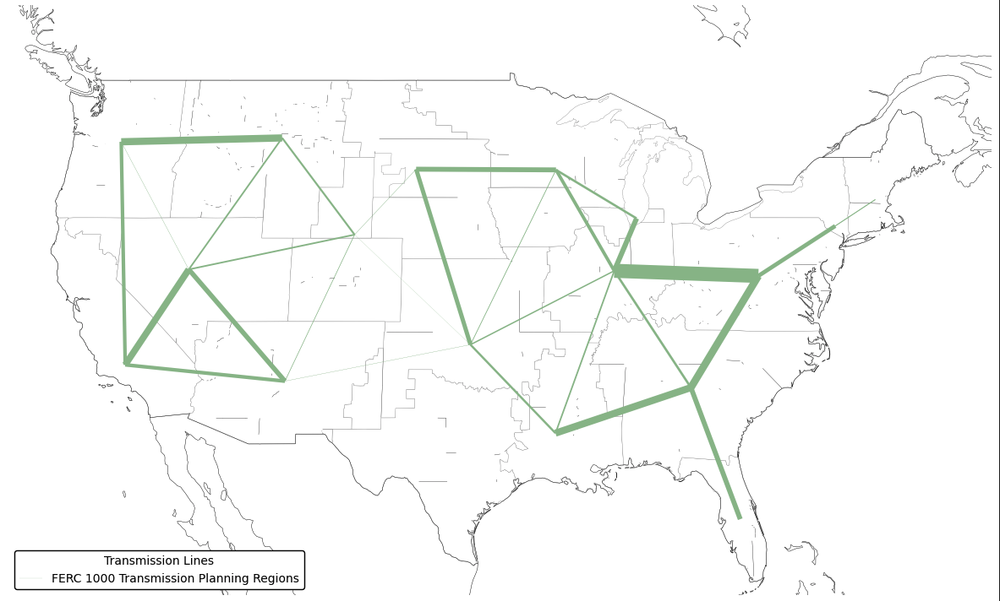

(data-transmission)=
# Transmission

## Transmission Networks

PyPSA-USA offers a unique capability by integrating two options of transmission networks: the ReEDS NARIS-derived zonal network and the Breakthrough Energy - Texas A&M University (TAMU) synthetic nodal network.


### ReEDS NARIS-based Networks

We integrate networks at three spatial scales (County, Balance Area, and FERC 1000) derived from the North American Renewable Integration Study ([NARIS](https://www.nrel.gov/analysis/naris.html)) network. These zonal networks are derived from the non-public NARIS nodal network for the US electricity system, by the authors in [Brown et. al.](https://arxiv.org/abs/2308.03612) and [Sergi et. al.](https://research-hub.nrel.gov/en/publications/transmission-interface-limits-for-high-spatial-resolution-capacit). These networks are calculated to be N-1 contingency compliant zonal transfer capacity limits. We describe how these networks can be meshed together to create custom network topologies on the `Spatial Configuration` page.

- **County ITls**: For higher resolution models that focus on limited spatial scopes, we integrate the county level ITL's which contain 3143 zones across the United States.
- **ReEDS Balancing Authorities**: The ReEDS balancing authority (BA) network has 137 zones across the United States boundaries and can be mapped to balancing authorities, NERC regions, and RTOs/ISOs. Smaller Balancing authorities are not individually represented in this network. For example, BANC is combined into the CAISO north region.
- **FERC 1000 Planning Regions**: The FERC 1000 network splits up FERC 1000 transmission planning regions in to 18 sub-regions and nodes for the United States. These 18 regions are supersets of the ReEDS Balancing Authorities, and respect state borders to enable enforcement of regional policy constraints.





### TAMU Synthetic Nodal Network

The **TAMU synthetic nodal network** offers a high-resolution representation of the US power system, specifically designed for operational simulations. See the [Xu. et al.](https://arxiv.org/abs/2002.06155) paper for a detailed description of the network. This network includes:

- **High Spatial Resolution**: Comprising 82,549 buses, 41,561 substations, 83,497 AC lines, and 17 HVDC lines, it provides a detailed view of a synthetic transmission network.
- **DC Power Flow**: Provides data for DC-power flow approximation.
- **Clustering**: Due to its high resolution, the TAMU network is not suitable for capacity expansion planning without clustering. As part of the PyPSA-USA workflow we implement the clustering algorithms developed by [M. Frysztracki et. al.](https://energyinformatics.springeropen.com/articles/10.1186/s42162-022-00187-7) and integrated into the PyPSA package.

While representative of the US electricity system, the TAMU network is synthetic and not precisely aligned with the actual US transmission network. As such we integrated the ReEDS NARIS dataset for planning applications where more precise inter-regional transfer capacity ratings are neccesary.


```{info}
See the [Spatial Configuration](./config-spatial.md) page for information on how to choose between networks.
```

(transmission-data)=
### Data
```{eval-rst}
.. csv-table::
   :header-rows: 1
   :widths: 22,22,33
   :file: datatables/transmission.csv
```
