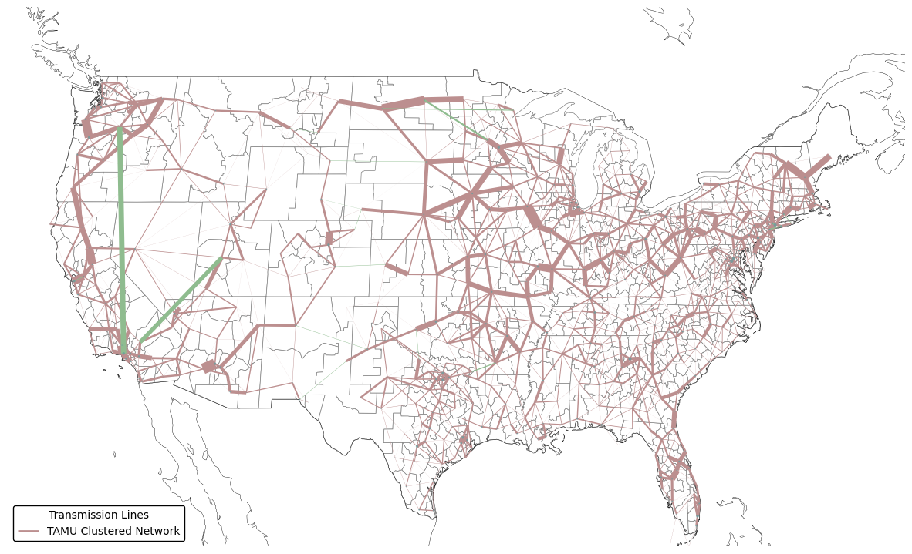
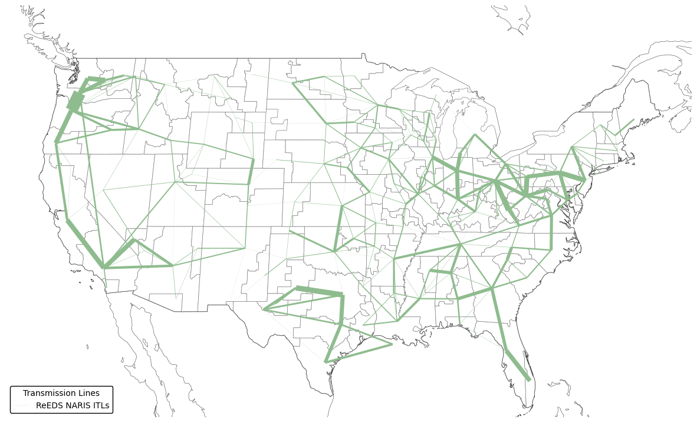

(data-transmission)=
# Transmission

## Transmission Networks

PyPSA-USA offers a unique capability by integrating two options of transmission networks: the ReEDS NARIS-derived zonal network and the Breakthrough Energy - Texas A&M University (TAMU) synthetic nodal network.

### TAMU Synthetic Nodal Network

The **TAMU synthetic nodal network** offers a high-resolution representation of the US power system, specifically designed for operational simulations. See the [Xu. et al.](https://arxiv.org/abs/2002.06155) paper for a detailed description of the network. This network includes:

- **High Spatial Resolution**: Comprising 82,549 buses, 41,561 substations, 83,497 AC lines, and 17 HVDC lines, it provides a detailed view of the transmission grid.
- **DC Power Flow**: Provides data for DC-power flow approximation.
- **Clustering**: Due to its high resolution, the TAMU network is not suitable for capacity expansion planning without clustering. As part of the PyPSA-USA workflow we implement the clustering algorithms developed by [M. Frysztracki et. al.](https://energyinformatics.springeropen.com/articles/10.1186/s42162-022-00187-7) and integrated into the PyPSA package.

While representative of the US electricity system, the TAMU network is synthetic and not precisely aligned with the actual US transmission network. As such we integrated the ReEDS NARIS dataset for planning applications where more precise inter-regional transfer capacity ratings are neccesary.



### ReEDS NARIS Zonal Network

The **ReEDS zonal network** is a Balancing Authority resolution transmission network derived from the North American Renewable Integration Study ([NARIS](https://www.nrel.gov/analysis/naris.html)) network. The network which divides the continental US into 137 zones. This network is designed to respect state boundaries and can be mapped to balancing authorities, NERC regions, and RTOs/ISOs. Key features of this network include:

- **Zonal Representation**: The network topology is designed for transport model type transmission representations, akin to modeling area interchanges as controllable DC-links.
- **N-1 Interface Limits**: The interface transmission limits are calculated using the method developed by [Brown et. al.](https://arxiv.org/abs/2308.03612). The ReEDS network uses the CEII protected NARIS dataset as the base nodal network from which the ITLS are calculated.
- **Suitable for Capacity Expansion**: The zonal network's lower spatial resolution is well-suited for capacity expansion planning, as it simplifies computational requirements.





### Usage

The TAMU network is the default transmission network in PyPSA-USA, you can modify it's resolution though the `simpl` and `clusters` wildcards in the configuration files.

To use the ReEDS network in PyPSA-USA, you must enable the `links: transport_model` setting, and set the proper number of `cluster` nodes for your modeled interconnection. You can find the details on number of nodes in each zone in the table below.

```{eval-rst}
.. csv-table::
   :header-rows: 1
   :widths: 22,22,33
   :file: datatables/transmission_nodes.csv
```

(transmission-data)=
### Data
```{eval-rst}
.. csv-table::
   :header-rows: 1
   :widths: 22,22,33
   :file: datatables/transmission.csv
```
