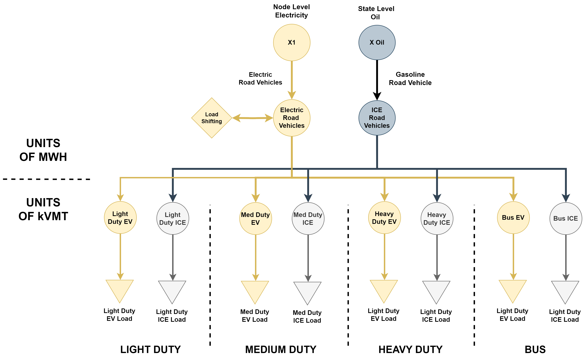
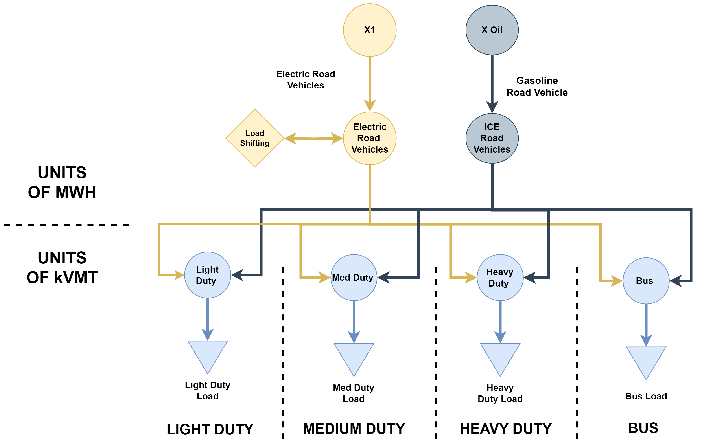
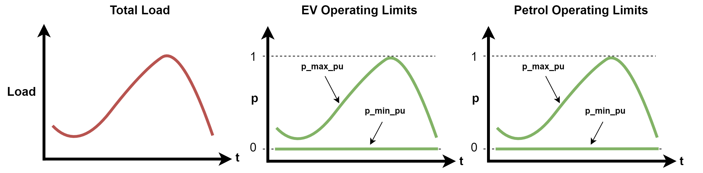
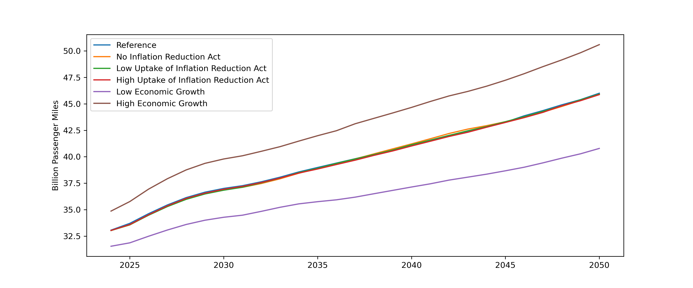
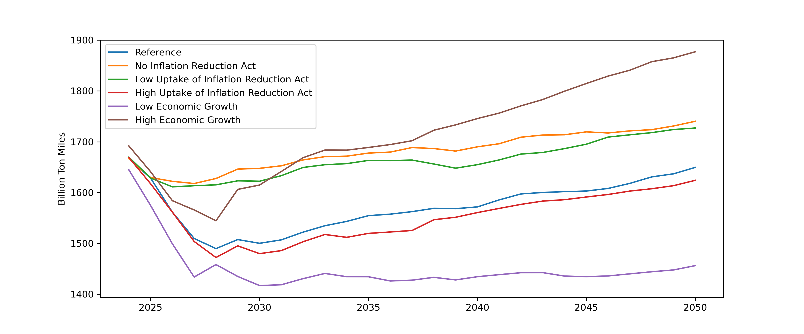

(data-transportation)=
# Transportation Sector

## Overview

The transportation module of PyPSA-USA is split into two categories; 1) Road transportation, and 2) Non-Road transportation. Each category has numerous vehicle types, with end-use units following transportation metrics, rather than energy (ie. vehicle miles travelled instead of MWh). This page will walk through how each category is represented, providing datasources and assumptions.

```{important}
Only road vehicles currently support answering technology trade-off questions. Non-road vehicles exist only for emission and cost tracking purposes.
```

## Road Vehicles

Four road vehicle classes are modelled in PyPSA-USA; Light-duty vehicles, medium-duty vehicles, heavy-duty vehicles, and buses. Demand for each of these vehicles can be met through electricity or petrol. Distinctions are not made between petrol levels (ie. regular gasoline is treated the same as diesel). Biogas, natural gas, hydrogen, and other transport fuels are not currently represented.

### Demand

Road vehicle demand is creted by overlaying load profiles ontop of annual demand values.

#### Load Profiles

Road transport electricity load profiles are extracted from the [NREL Electrification Futures Study](https://www.nrel.gov/analysis/electrification-futures.html) (EFS). This study gives state level expected load for each of the four vehicle classes in select future years. An example of of these load profiles is given in the following figure. Non-electrical vehicle load profiles are uniform; ie. petrol load does not have a load profile.

:::{figure-md} efs-electricity


Example Electrical Vehicle Load Profiles for a Single Bus in 2018 and 2050. Gray lines are hourly profiles over the year. The blue line is the average profile over the year. (a) Light-Duty Vehicles. (b) Medium-Duty Vehicles. (c) Heavy-Duty Vehicles. (d) Buses.
:::

The EFS study gives electrical load magnitude, however, it does not give the corresponding petrol magnitude[^1]. Therefore, only the charging profiles from EFS are used. These profiles are dissagreated across the state following the same population based dissagregation strategy as service level demand.

#### Annual Load

Historical and Projected annual load values are extracted from the [EIA Annual Energy Outlook](https://www.eia.gov/outlooks/aeo/) (AEO). [Transportation travel indicators](https://www.eia.gov/outlooks/aeo/data/browser/#/?id=7-AEO2023&cases=ref2023&sourcekey=0) by mode are used as annual demand from the AEO, not energy use by mode. This is due to AEO energy use results already taking into account energy efficiency measures - something that PyPSA-USA solves for. The figure below shows projected demand for the four vehicle modes taken from the AEO.

:::{figure-md} aeo-light-duty


Annual Energy Outlook light-duty road vehicle travel indicator projections, with select scenarios.
:::

:::{figure-md} aeo-medium-duty


Annual Energy Outlook medium-duty road vehicle travel indicator projections, with select scenarios.
:::

:::{figure-md} aeo-heavy-duty


Annual Energy Outlook heavy-duty road vehicle travel indicator projections, with select scenarios.
:::

:::{figure-md} aeo-bus


Annual Energy Outlook bus travel indicator projections, with select scenarios.
:::

Notably, travel indicators are in units of vehicle-miles travelled (or similar); which is not a unit of energy like the other sectors in PyPSA-USA. Efficiency assumptions (miles/energy) for each vehicle type operating on each fuel (petrol and electricity) are extracted from the EFS and AEO. The next section on road transport capacity expansion gives further details on how efficiency metrics interface with investment decisions.

### Capacity Expansion

Two capacity expansion options exist for road transportation in PyPSA-USA. Users can either set state-level electrification mandates, or users can allow the model to perfom investment decisions endogenously.

```{note}
Mode shifting studies are not currently supported (ie. Switching light-duty demand to bus demand)
```

#### Exogenous Investment

Users can explicitly tell PyPSA-USA how much of the vehicle load by mode is met by electricity and petrol. This is useful in cicumstances where research questions involve evaluating specific vehicle mandates.

When running in exogenous investment mode, the total demand by vehicle type is split into two categories; electricity and petrol. Electricity load follows the profiles described above. Petrol loads are flat and distributed evenly over the year. A schematic of the exogenous transport investment decisions is given in the figure below.

:::{figure-md} exogenous-load


Schematic of how exogenous road transport investment is setup in PyPSA-USA
:::

#### Endogenous Investment

Alternatively, users can allow PyPSA-USA to make road transport investment decisions. This is useful when research questions involve evaluating the impacts of one vehicle type against another.

When running in endogenous investment mode, the total demand by vehicle type is grouped into a single load. Both electrical and petrol vehicle capacity can be invested in to meet the total load. A schematic of the endogenous transport investment decisions is given in the figure below.

:::{figure-md} endogenous-load


Schematic of how endogenous road transport investment is setup in PyPSA-USA
:::

A challenge with endogenous investment decisions is modifying the electrical load to account for a greater share of EVs in the system. Load is exogenous to the system, meaning it must be defined by the user. However, if more EVs are invested in, then the magnitude of the electrical load profile should grow. To account for this, two configuration options are exposed to the user.

With endogenous road transport, users can set EVs to must-run. In this configuration, the total load per vehicle type profile is set to match the EV load profile. The EV links minimum and maximum operating limits are set to match the load profile. The petrol links are free to operate as little or as much as they like. This setup forces EVs to always be run, and petrol vehicles to fill in remaining load. A schematic of this is shown in the figure below.

:::{figure-md} must-run-ev


Schematic of *Must-Run EV* configuration for endogenous road transport investments
:::

Alternatively, with endogenous road transport users can set EVs and petrol vehicles to operate as little or as much as they like.
In this configuration, the total load per vehicle type profile is set to match the EV load profile (same as must-run). The EV and petrol maximum generation matches that of the load profile, and both have a no lower generation requirement. In this setup, EVs and petrols are free to contribute as much or as little to the demand as they like; ie. petrol cars can act as a "peaking" resource. A schematic of this is shown in the figure below.

:::{figure-md} vehicle-choice


Schematic of *Vehicle Choice* configuration for endogenous road transport investments
:::

## Non-Road Vehicles

Four non-road vehicle classes are modelled in PyPSA-USA; passenger air-travel, passenger rail-travel, shipping rail, and domestic marine shipping. Demand for each of these vehicles **can only be met through petrol**. Currently, these travel modes are included for emission accounting purposes only.

### Implementation

The following figure gives an overview of the non-road vehicle transportation implmented in PyPSA-USA. Load can only be met through petrol, as PyPSA-USA does not currently support policy decisions around non-road transport.

:::{figure-md} non-road-transport


Schematic of non-road vehicle implementation in PyPSA-USA
:::

### Demand

Non-road transport demand do not have load profiles. Rather, yearly load values are distributed evenly over the full year. Following the same method as road vehicle transportation, yearly travel demands are obtained from the EIA [Annual Energy Outlook](https://www.eia.gov/outlooks/aeo/) (AEO) [travel indicators](https://www.eia.gov/outlooks/aeo/data/browser/#/?id=7-AEO2023&cases=ref2023&sourcekey=0). The following figures show the AEO travel demand projections that PyPSA-USA ingests.

:::{figure-md} aeo-rail-passenger


Annual Energy Outlook passenger rail travel indicator projections, with select scenarios.
:::

:::{figure-md} aeo-air-passenger


Annual Energy Outlook passenger aircraft travel indicator projections, with select scenarios.
:::

:::{figure-md} aeo-rail-freight


Annual Energy Outlook shipping freight rail travel indicator projections, with select scenarios.
:::

:::{figure-md} aeo-shipping


Annual Energy Outlook domestic marine shipping travel indicator projections, with select scenarios.
:::


[^1]: EFS does give vehicel sales shares in Figure 4.1 [here](https://www.nrel.gov/docs/fy18osti/71500.pdf). However, these values are sales shares, not stock shares, and report at national levels, rather than state.

## Data Sources

Listed below are the main datasources used in the transportation sector.

```{eval-rst}
.. csv-table::
   :header-rows: 1
   :widths: 22,22,22
   :file: datatables/transport_sector_data.csv
```

## Validation

```{note}
Sector coupling studies are all under active development. More info to come!
```
