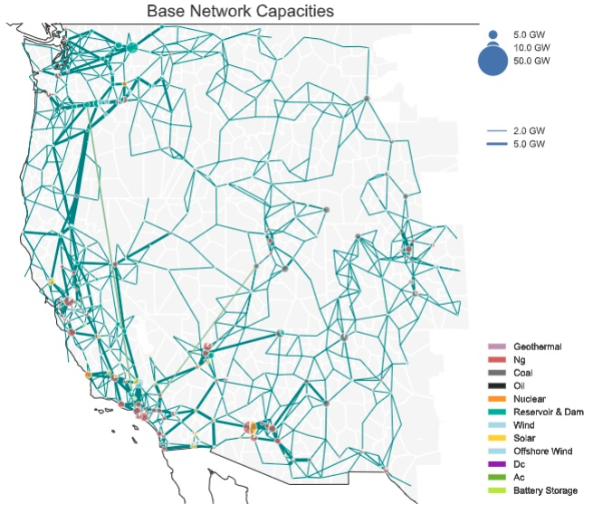

% pypsa-usa documentation master file, created by
% sphinx-quickstart on Thu Aug 17 14:02:31 2023.
% You can adapt this file completely to your liking, but it should at least
% contain the root `toctree` directive.

# PyPSA USA

```{warning}
**This model is under active development. The western interconnection is stable, however you are likely to find bugs in the workflow as we continue to develop the model. Please file [github issues](https://github.com/PyPSA/pypsa-usa/issues) or email ktehranchi@stanford.edu or trevor_barnes@sfu.ca for support**
```

PyPSA-USA is an open-source power systems model of the transmission system in the United States. It is a highly configurable power systems model that can be used for capacity expansion modeling, production cost simulation, and power flow analysis. This workflow draws from the work of [pypsa-eur](https://pypsa-eur.readthedocs.io/en/latest/index.html) and [pypsa-meets-earth](https://pypsa-earth.readthedocs.io/en/latest/) projects.

% update to be a url


<!-- ```{include} ../../README.md
:relative-images:
``` -->

<!-- # Indices and tables

- {ref}`genindex`
- {ref}`modindex`
- {ref}`search` -->

<!-- ```{toctree}
:caption: 'Contents:'
:maxdepth: 2
``` -->

```{toctree}
:caption: 'Getting Started:'
:maxdepth: 1
:hidden:

about-introduction
about-install
about-tutorial
```

```{toctree}
:caption: 'Configuration:'
:maxdepth: 1
:hidden:

config-wildcards
config-configuration
config-assumptions
```

```{toctree}
:caption: 'Rules Overview:'
:maxdepth: 1
:hidden:

rules-retrieving-data
rules-build-network
rules-build-sector-network
rules-simplify
rules-solve
rules-summary
```

```{toctree}
:caption: 'Reference:'
:maxdepth: 1
:hidden:

license
changelog
contributing
```
