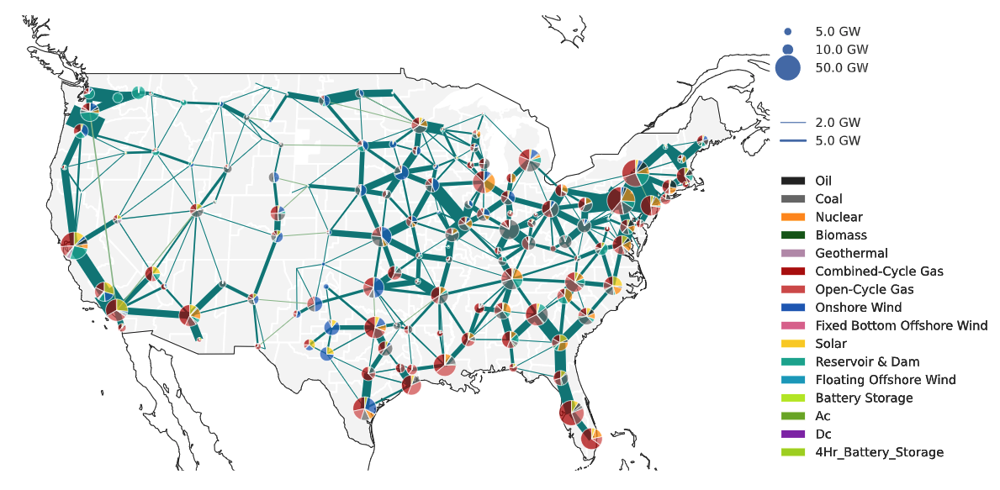

% pypsa-usa documentation master file, created by
% sphinx-quickstart on Thu Aug 17 14:02:31 2023.
% You can adapt this file completely to your liking, but it should at least
% contain the root `toctree` directive.

# PyPSA-USA

```{warning}
**This model is under active development. If you would like to chat about using the model please don't hesitate to reach out to ktehranchi@stanford.edu and trevor_barnes@sfu.ca for support**
```

PyPSA-USA is an open-source energy system dataset of the United States energy system designed for expansion planning and operational simulations.

% update to be a url


PyPSA-USA provides you with a toolkit to customize the **data** and **policy constraints** of energy system planning model with ease. Through configuration file you can control the spatial, temporal, and operational resolution of your energy system model with access to cleaned and prepared historical and forecasted data. This means, you can build a model of **ERCOT, WECC, or the Eastern interconnection**, where the transmission network is clustered to **N nodes**, respecting the boundaries of **balancing areas, states, or REeDs shape boundaries**, using **historical EIA-930 demand data years 2018-2023** or **NREL EFS forcasted demand**, with **historical fuel prices from ISOs/EIA**, and capital cost projections from the **NREL Annual Technology Baseline**.

You can create and export the power system data model to use in your own homebrewed optimization model OR use the built-in PyPSA-USA optimization features to layer on additional policy and operational constraints. For planning studies, we've integrated data on regional Renewable Portfolio Standards (RPS), emissions constraints, and other state-level policy constraints. We're actively building this model so more features are on the way!

PyPSA-USA builds on and leverages the work of [PyPSA-EUR](https://pypsa-eur.readthedocs.io/en/latest/index.html) developed by TU Berlin. PyPSA-USA is actively developed by the [INES Research Group](https://ines.stanford.edu) at Stanford University and the [ΔE+ Research Group](https://www.sfu.ca/see/research/delta-e.html) at Simon Fraser University.


<!-- ```{include} ../../README.md
:relative-images:
``` -->

<!-- # Indices and tables

- {ref}`genindex`
- {ref}`modindex`
- {ref}`search` -->

<!-- ```{toctree}
:caption: 'Contents:'
:maxdepth: 2
``` -->

```{toctree}
:caption: 'Getting Started:'
:maxdepth: 1
:hidden:

about-introduction
about-install
about-usage
```

```{toctree}
:caption: 'Configuration:'
:maxdepth: 1
:hidden:

config-wildcards
config-configuration
config-sectors
```

```{toctree}
:caption: 'Rules Overview:'
:maxdepth: 1
:hidden:

rules-retrieving-data
rules-build-network
rules-build-sector-network
rules-simplify
rules-solve
rules-summary
```

```{toctree}
:caption: 'Reference:'
:maxdepth: 1
:hidden:

license
changelog
contributing
```
